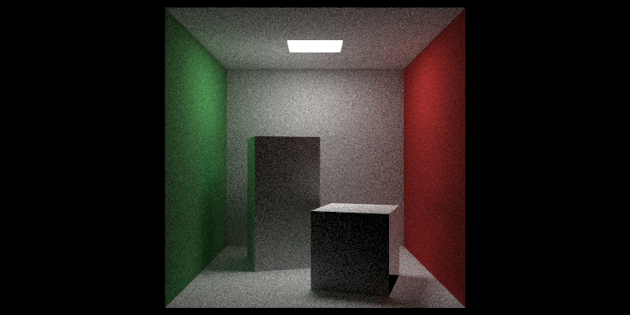

RayTracingWeekend
---

Implementation based on book **Ray Tracing Minibooks Book** series by **Peter Shirley**.

### Progress

- [x] [Ray Tracing in One Weekend (Ray Tracing Minibooks Book 1)](https://www.amazon.com/Ray-Tracing-Weekend-Minibooks-Book-ebook/dp/B01B5AODD8/)
- [ ] [Ray Tracing: the Next Week (Ray Tracing Minibooks Book 2)](https://www.amazon.com/Ray-Tracing-Next-Week-Minibooks-ebook/dp/B01CO7PQ8C/)
- [ ] [Ray Tracing: The Rest Of Your Life (Ray Tracing Minibooks Book 3)](https://www.amazon.com/Ray-Tracing-Rest-Your-Minibooks-ebook/dp/B01DN58P8C/)

### Additional Contents in this repo

- Use C++11 more than original code in book
- Utilize <ppl.h> for concurrency
- Add several unit tests for math code
- Call "convert" from Imagemagick/GraphicsMagick to convert output ppm to png and open it to check result
